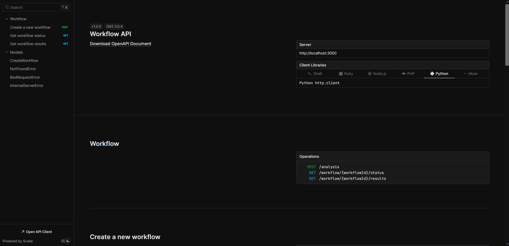
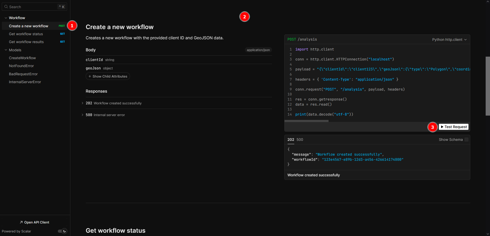
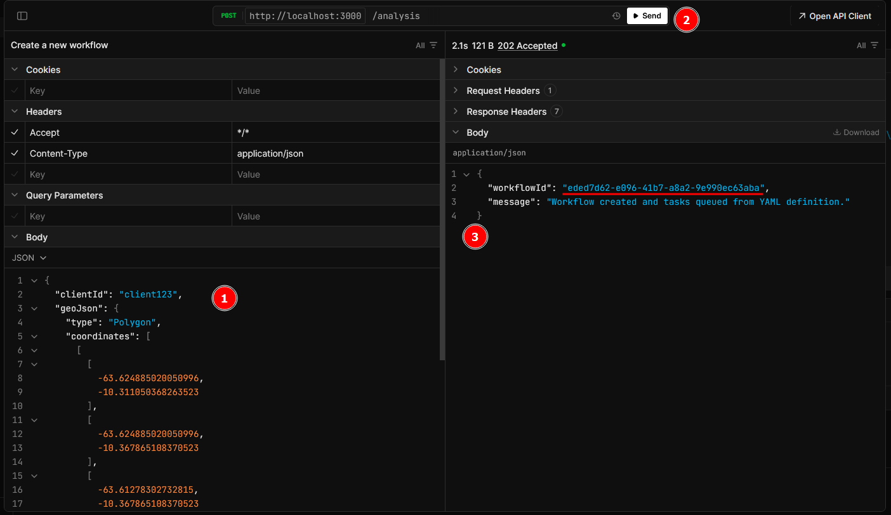
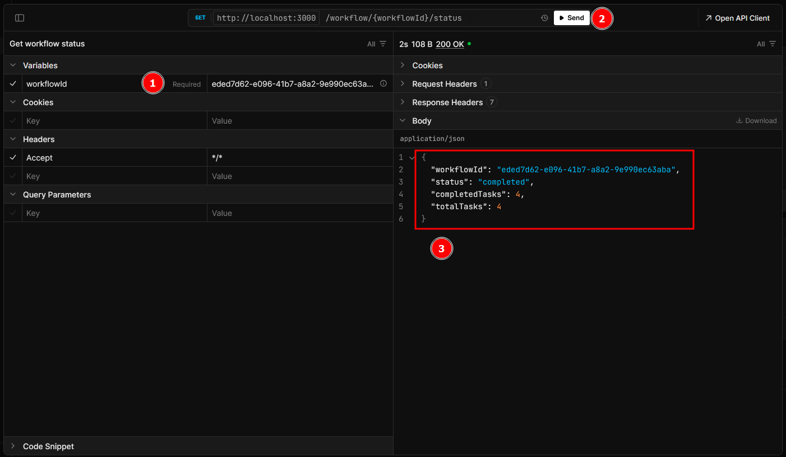
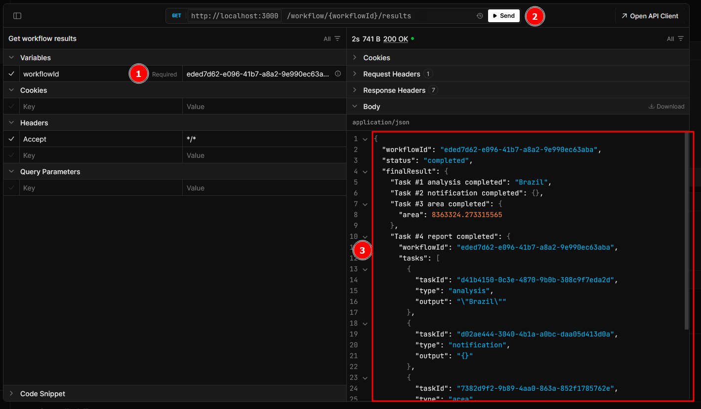
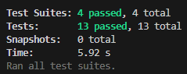
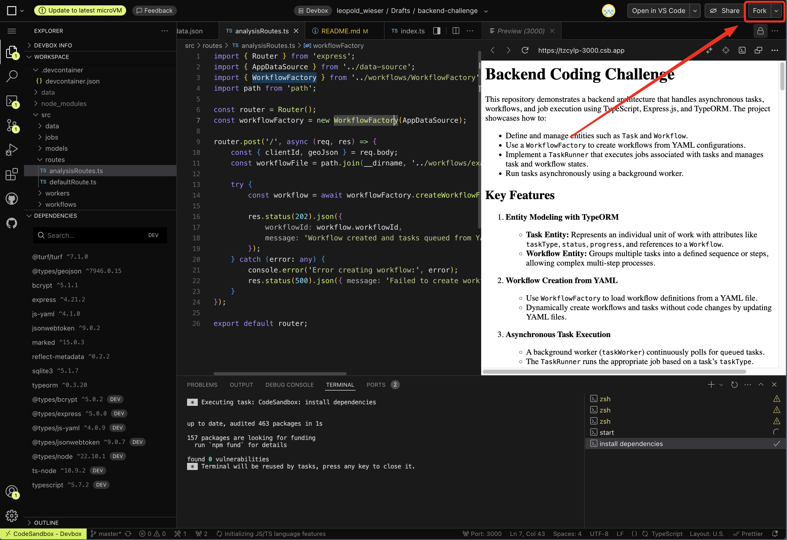

# Backend Coding Challenge

## New Features

### Manual tests

Start the server with 
```bash
yarn dev or npm run dev
```

And navigate to http://localhost:3000/api-docs

Where you will find the 3 endpoints described below

#### Creating Workflows (no usage changes from previous implementation)

1. Click on it to autoscroll to the endpoint definition
2. Here you will see the details of the endpoint and examples
3. Click on `Test Request` to open the testing modal


1. Request is prefilled with example from this readme, update as needed
2. Click send
3. Copy the workflowId to use it in next steps

Notes:
- Feel free to update `example_workflow.yml` to change the workflow. (available reports can be found at JobFactory.ts)
- There is a `cyclic_workflow.yml` used in automatic tests to check if detecting is working (changing this file only affects test files)

#### Getting a workflow status


1. Fill the ID in the GET status endpoint
2. Click send
3. Workflow status

#### Getting a workflow result


1. Fill the ID in the GET results endpoint
2. Click send
3. Workflow result

Note: workflow has to finish first, else you will get a 400 bad request error

### Automated tests

Added a few packages for testing

```bash
yarn install or npm install
```

To run tests just run the command below

```bash
yarn test
```




---
Some sections below have been updated

## Getting Started

1. Fork the Project:
   
2. Start Coding

This repository demonstrates a backend architecture that handles asynchronous tasks, workflows, and job execution using TypeScript, Express.js, and TypeORM. The project showcases how to:

- Define and manage entities such as `Task` and `Workflow`.
- Use a `WorkflowFactory` to create workflows from YAML configurations.
- Implement a `TaskRunner` that executes jobs associated with tasks and manages task and workflow states.
- Run tasks asynchronously using a background worker.

## Key Features

1. **Entity Modeling with TypeORM**

   - **Task Entity:** Represents an individual unit of work with attributes like `taskType`, `status`, `progress`, and references to a `Workflow`.
   - **Workflow Entity:** Groups multiple tasks into a defined sequence or steps, allowing complex multi-step processes.

2. **Workflow Creation from YAML**

   - Use `WorkflowFactory` to load workflow definitions from a YAML file.
   - Dynamically create workflows and tasks without code changes by updating YAML files.

3. **Asynchronous Task Execution**

   - A background worker (`taskWorker`) continuously polls for `queued` tasks.
   - The `TaskRunner` runs the appropriate job based on a task’s `taskType`.

4. **Robust Status Management**

   - `TaskRunner` updates the status of tasks (from `queued` to `in_progress`, `completed`, or `failed`).
   - Workflow status is evaluated after each task completes, ensuring you know when the entire workflow is `completed` or `failed`.

5. **Dependency Injection and Decoupling**
   - `TaskRunner` takes in only the `Task` and determines the correct job internally.
   - `TaskRunner` handles task state transitions, leaving the background worker clean and focused on orchestration.

## Project Structure

```
src
├─ controllers/               # NEW: Controller layer to handle calls between express request/response and services (business logic)
│   ├─ WorkflowController.ts  # NEW: Handles new workflow routes
│   ├─ responseHandler.ts     # NEW: Handles sending express responses
│
├─ data/
│   ├─ world_data.json  # Contains world data for analysis
│
├─ fixtures/  # NEW: Data used in test files
│
├─ jobs/
│   ├─ DataAnalysisJob.ts (example)
│   ├─ EmailNotificationJob.ts (example)
│   ├─ Job.ts                    # Job interface
│   ├─ JobFactory.ts             # getJobForTaskType function for mapping taskType to a Job
│   ├─ PolygonAreaJob.ts         # NEW: Calculates the area of a polygon from the GeoJSON provided in the task
│   ├─ ReportGenerationJob.ts    # NEW: Generates a report by aggregating the outputs of multiple tasks in the workflow
│
├─ middlewares/
│   ├─ errorHandler.ts  # NEW: Contains asyncHandler utility to catch exceptions and pass them to a generic error handler for express
│
├─ models/
│   ├─ Result.ts     # Defines the Result entity
│   ├─ Task.ts       # Defines the Task entity
│   ├─ Workflow.ts   # Defines the Workflow entity
│
├─ routes/
│   ├─ analysisRoutes.ts   # POST /analysis endpoint to create workflows
│   ├─ defaultRoute.ts     # UPDATED: renders/serves Readme file and api docs
│   ├─ workflowRoutes.ts   # NEW: GET routes for workflow status and report
│
├─ services/               # NEW: Business logic here
│   ├─ WorkflowService.ts  # NEW: Workflow related business logic
│
├─ utils/
│   ├─ graph.ts   # NEW: Contains utility functions to detect cyclic dependencies in workflow files
│   ├─ report.ts  # NEW: Contains different ways to generate finalReport field
│
├─ workers/
│   ├─ taskRunner.ts  # Handles job execution & task/workflow state transitions
│   ├─ taskWorker.ts  # Background worker that fetches queued tasks & runs them
│
├─ workflows/
│   ├─ *.yaml              # Available workflows YAML definitions
│   ├─ WorkflowFactory.ts  # Creates workflows & tasks from a YAML definition
│
├─ data-source.ts    # TypeORM DataSource configuration
└─ index.ts          # Express.js server initialization & starting the worker
```

## Getting Started

### Prerequisites

- Node.js (LTS recommended)
- npm or yarn
- SQLite or another supported database

### Installation

1. **Clone the repository:**

   ```bash
   git clone https://github.com/yourusername/backend-coding-challenge.git
   cd backend-coding-challenge
   ```

2. **Install dependencies:**

   ```bash
   npm install
   ```

3. **Configure TypeORM:**

   - Edit `data-source.ts` to ensure the `entities` array includes `Task` and `Workflow` entities.
   - Confirm database settings (e.g. SQLite file path).

4. **Create or Update the Workflow YAML:**
   - Place a YAML file (e.g. `example_workflow.yml`) in a `workflows/` directory.
   - Define steps, for example:
     ```yaml
     name: "example_workflow"
     steps:
       - taskType: "analysis"
         stepNumber: 1
       - taskType: "notification"
         stepNumber: 2
     ```

### Running the Application

1. **Compile TypeScript (optional if using `ts-node`):**

   ```bash
   npx tsc
   ```

2. **Start the server:**

   ```bash
   npm start
   ```

   If using `ts-node`, this will start the Express.js server and the background worker after database initialization.

3. **Create a Workflow (e.g. via `/analysis`):**

   ```bash
   curl -X POST http://localhost:3000/analysis \
   -H "Content-Type: application/json" \
   -d '{
    "clientId": "client123",
    "geoJson": {
        "type": "Polygon",
        "coordinates": [
            [
                [
                    -63.624885020050996,
                    -10.311050368263523
                ],
                [
                    -63.624885020050996,
                    -10.367865108370523
                ],
                [
                    -63.61278302732815,
                    -10.367865108370523
                ],
                [
                    -63.61278302732815,
                    -10.311050368263523
                ],
                [
                    -63.624885020050996,
                    -10.311050368263523
                ]
            ]
        ]
    }
    }'
   ```

   This will read the configured workflow YAML, create a workflow and tasks, and queue them for processing.

4. **Check Logs:**
   - The worker picks up tasks from `queued` state.
   - `TaskRunner` runs the corresponding job (e.g., data analysis, email notification) and updates states.
   - Once tasks are done, the workflow is marked as `completed`.

### **Coding Challenge Tasks for the Interviewee**

The following tasks must be completed to enhance the backend system:

---

### **1. Add a New Job to Calculate Polygon Area**

**Objective:**  
Create a new job class to calculate the area of a polygon from the GeoJSON provided in the task.

#### **Steps:**

1. Create a new job file `PolygonAreaJob.ts` in the `src/jobs/` directory.
2. Implement the `Job` interface in this new class.
3. Use `@turf/area` to calculate the polygon area from the `geoJson` field in the task.
4. Save the result in the `output` field of the task.

#### **Requirements:**

- The `output` should include the calculated area in square meters.
- Ensure that the job handles invalid GeoJSON gracefully and marks the task as failed.

---

### **2. Add a Job to Generate a Report**

**Objective:**  
Create a new job class to generate a report by aggregating the outputs of multiple tasks in the workflow.

#### **Steps:**

1. Create a new job file `ReportGenerationJob.ts` in the `src/jobs/` directory.
2. Implement the `Job` interface in this new class.
3. Aggregate outputs from all preceding tasks in the workflow into a JSON report. For example:
   ```json
   {
     "workflowId": "<workflow-id>",
     "tasks": [
       { "taskId": "<task-1-id>", "type": "polygonArea", "output": "<area>" },
       {
         "taskId": "<task-2-id>",
         "type": "dataAnalysis",
         "output": "<analysis result>"
       }
     ],
     "finalReport": "Aggregated data and results"
   }
   ```
4. Save the report as the `output` of the `ReportGenerationJob`.

#### **Requirements:**

- Ensure the job runs only after all preceding tasks are complete.
- Handle cases where tasks fail, and include error information in the report.

---

### **3. Support Interdependent Tasks in Workflows**

**Objective:**  
Modify the system to support workflows with tasks that depend on the outputs of earlier tasks.

#### **Steps:**

1. Update the `Task` entity to include a `dependency` field that references another task
2. Modify the `TaskRunner` to wait for dependent tasks to complete and pass their outputs as inputs to the current task.
3. Extend the workflow YAML format to specify task dependencies (e.g., `dependsOn`).
4. Update the `WorkflowFactory` to parse dependencies and create tasks accordingly.

#### **Requirements:**

- Ensure dependent tasks do not execute until their dependencies are completed.
- Test workflows where tasks are chained through dependencies.

---

### **4. Ensure Final Workflow Results Are Properly Saved**

**Objective:**  
Save the aggregated results of all tasks in the workflow as the `finalResult` field of the `Workflow` entity.

#### **Steps:**

1. Modify the `Workflow` entity to include a `finalResult` field:
2. Aggregate the outputs of all tasks in the workflow after the last task completes.
3. Save the aggregated results in the `finalResult` field.

#### **Requirements:**

- The `finalResult` must include outputs from all completed tasks.
- Handle cases where tasks fail, and include failure information in the final result.

---

### **5. Create an Endpoint for Getting Workflow Status**

**Objective:**  
Implement an API endpoint to retrieve the current status of a workflow.

#### **Endpoint Specification:**

- **URL:** `/workflow/:id/status`
- **Method:** `GET`
- **Response Example:**
  ```json
  {
    "workflowId": "3433c76d-f226-4c91-afb5-7dfc7accab24",
    "status": "in_progress",
    "completedTasks": 3,
    "totalTasks": 5
  }
  ```

#### **Requirements:**

- Include the number of completed tasks and the total number of tasks in the workflow.
- Return a `404` response if the workflow ID does not exist.

---

### **6. Create an Endpoint for Retrieving Workflow Results**

**Objective:**  
Implement an API endpoint to retrieve the final results of a completed workflow.

#### **Endpoint Specification:**

- **URL:** `/workflow/:id/results`
- **Method:** `GET`
- **Response Example:**
  ```json
  {
    "workflowId": "3433c76d-f226-4c91-afb5-7dfc7accab24",
    "status": "completed",
    "finalResult": "Aggregated workflow results go here"
  }
  ```

#### **Requirements:**

- Return the `finalResult` field of the workflow if it is completed.
- Return a `404` response if the workflow ID does not exist.
- Return a `400` response if the workflow is not yet completed.

---

### **Deliverables**

- **Code Implementation:**

  - New jobs: `PolygonAreaJob` and `ReportGenerationJob`.
  - Enhanced workflow support for interdependent tasks.
  - Workflow final results aggregation.
  - New API endpoints for workflow status and results.

- **Documentation:**
  - Update the README file to include instructions for testing the new features.
  - Document the API endpoints with request and response examples.

---
